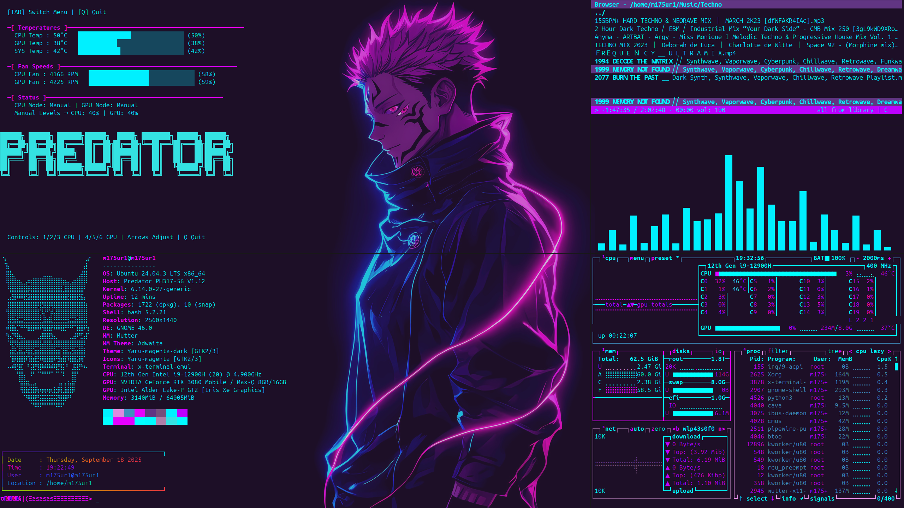
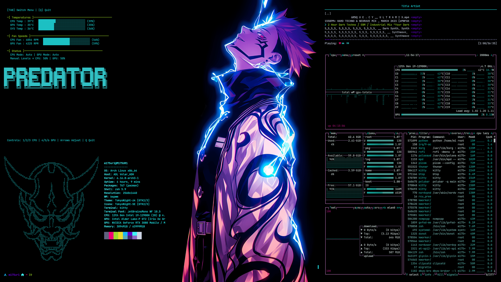

# Acer Predator Fan & RGB Controller (Linux)

## Screenshots  
**Ubuntu**  
  

**Arch**  
  

---

## Credits  
This project merges and simplifies the work of:  
- [Linux-Acer-Predator-Triton-500-Keyboard-RGB-Fix](https://github.com/DoStraTech)  
- [acer-predator-turbo-and-rgb-keyboard-linux-module](https://github.com/JafarAkhondali)  
- [Linux-PredatorSense](https://github.com/snowyoneill)  

It combines **fan control** and **RGB keyboard lighting** for **Acer Predator laptops** with a **USB HID per-key keyboard**, all in a single installer and terminal interface.  

**Note:** If your laptop does not use a USB HID per-key keyboard, this will not work.  

To verify your keyboard, run `lsusb`. If you see a line like:  
`Bus 003 Device 004: ID 04f2:0117 Chicony Electronics Co., Ltd USB-HID Gaming Keyboard (C)`  
your device is supported.  

---

## Features  
- Unlocks **Turbo button**  
- Control **CPU & GPU fans** (Auto / Turbo / Manual)  
- Fine-grained manual fan speed control  
- Keyboard **RGB color & effects** control  
- Systemd service restores RGB settings on boot/resume  

**Tested on:** Predator PH317-56 Helios 300  
**Verified on:** Ubuntu, Arch, Kali (should work on most Debian-based distros)  
Other Predator models may work, but EC byte positions and IDs may vary.  

---

## Installation  

1. Navigate to Downloads:  
```bash
cd ~/Downloads
```  

3. Clone the repository:  
```bash
git clone https://github.com/NT411/Acer-Predator-Fan-RGB-Controller-Linux-.git
```  

5. Enter the main folder:  
```bash
cd Acer-Predator-Fan-RGB-Controller-Linux-/ACER_RGB_FAN_CONTROL/
```  

7. Make the installer executable:
- Ubuntu/Debian →
```bash
chmod +x ./install.sh
```  
- Arch →
```bash
chmod +x ./archinstall.sh
```  

9. Run the installer:  
- Ubuntu/Debian →
```bash
sudo ./install.sh
```  
- Arch →
```bash
sudo ./archinstall.sh
```  

10. Add an alias for convenience:  
- For Bash →
```bash
nano ~/.bashrc
```  
- For Zsh →
```bash
nano ~/.zshrc
```  

Add this line at the bottom:  
```bash
alias predator='sudo python3 ~/Downloads/Acer-Predator-Fan-RGB-Controller-Linux-/ACER_RGB_FAN_CONTROL/main.py'
```
For Arch 
```bash
alias predator='sudo python ~/Downloads/Acer-Predator-Fan-RGB-Controller-Linux-/ACER_RGB_FAN_CONTROL/main.py'
```

11. Reboot:  
```bash
sudo reboot
```  

13. Start the script:  
```bash
predator
```  

---

## Uninstallation  

```bash
cd ~/Downloads/Acer-Predator-Fan-RGB-Controller-Linux-/ACER_RGB_FAN_CONTROL/
```  
```bash
sudo ./uninstall.sh
```  

This will:  
- Stop and remove the RGB fix systemd service  
- Remove the `predator` alias  
- Unload and delete the custom `facer` driver  
- Restore the stock `acer_wmi` driver  

---

## Usage (Main Script)  

After running `predator`, you’ll see a terminal interface with fan & RGB options.  

### Fan / Temp Monitor Keys  
- `1` → CPU Auto  
- `2` → CPU Turbo  
- `3` → CPU Manual  
- `4` → GPU Auto  
- `5` → GPU Turbo  
- `6` → GPU Manual  
- `↑ / ↓` → CPU fan % in Manual mode  
- `→ / ←` → GPU fan % in Manual mode  
- `q` → Quit  

### RGB Control Menu  
- Choose effect (**Static, Pulse, Rainbow**, etc.)  
- Set brightness (0–50, or up to 255 on some models)  
- Choose color (**Red, Green, Blue, Yellow, Pink, White**)  

---

## Known Issues  
- If RGB does not light up, check that `fix_keyboard.py` has the correct **Vendor ID** and **Product ID** from your keyboard (`lsusb`).  


