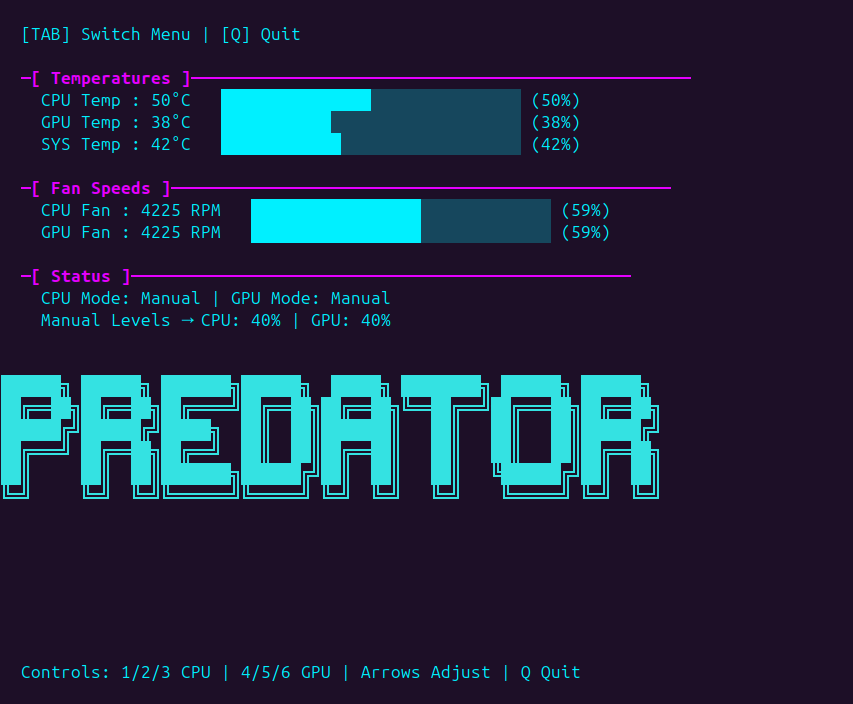
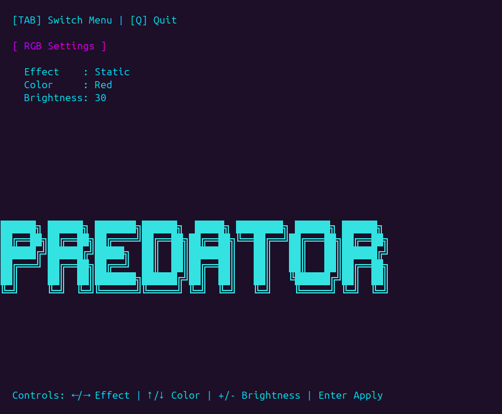

# Acer Predator Fan & RGB Controller (Linux)

## FAN Settings


### RGB Settings


## Credits
This project merges and simplifies work from:
- [Linux-Acer-Predator-Triton-500-Keyboard-RGB-Fix](https://github.com/DoStraTech)
- [acer-predator-turbo-and-rgb-keyboard-linux-module](https://github.com/JafarAkhondali)
- [Linux-PredatorSense](https://github.com/snowyoneill)

It combines fan and RGB control for **Acer Predator laptops** with a **USB HID per-key keyboard** into a single installer and terminal interface.

⚠️ **If you are not using a USB HID per-key keyboard, this will not work for you.**

To check if your Predator has a USB HID per-key keyboard, run:
```bash
lsusb
```
If the output includes something like this, it will work:
```bash
Bus 003 Device 004: ID 04f2:0117 Chicony Electronics Co., Ltd USB-HID Gaming Keyboard (C)
```

---

## Features
- Unlocks Turbo button
- Control **CPU & GPU fans** (Auto / Turbo / Manual)
- Per-fan control in Manual mode
- Keyboard **RGB effects & color** control
- Systemd service to restore RGB on boot/resume

Tested on **Predator PH317-56 Helios 300**  
Verified on **Ubuntu** and **Kali** — should work on most Debian-based distros  
⚠️ Other Predator models may also work, but EC byte positions and IDs may vary

---

## 🚀 Installation
1. Download and unzip this project or clone it.  
2. Open a terminal and enter the folder:
   ```bash
   cd ACER_RGB_FAN_CONTROL
   ```
3. Run the installer:
   ```bash
   sudo ./install.sh
   ```
4. Start the controller:
   ```bash
   sudo python3 main.py
   ```
5. If it doesn’t work, reboot and try again:
   ```bash
   sudo python3 main.py
   ```

---

## Uninstallation
To completely remove the tool and restore defaults:
```bash
cd ACER_RGB_FAN_CONTROL
sudo ./uninstall.sh
```

This will:
- Stop and remove the RGB fix systemd service  
- Remove the `predator` alias  
- Unload and delete the custom `facer` driver  
- Restore the stock `acer_wmi` driver  

---

## 🖥️ Usage (Main Script)
After running:
```bash
sudo python3 main.py
```
You’ll see a TUI (terminal interface) with fan & RGB options.

### Fan / Temp Monitor Keys:
- `1` → CPU Auto  
- `2` → CPU Turbo  
- `3` → CPU Manual  
- `4` → GPU Auto  
- `5` → GPU Turbo  
- `6` → GPU Manual  
- `↑ / ↓` → CPU fan % in Manual mode  
- `→ / ←` → GPU fan % in Manual mode  
- `q` → Quit  

### RGB Control Menu:
- Choose effect (**Static, Pulse, Rainbow**, etc.)  
- Set brightness (0–50, or up to 255 on some models)  
- Choose color (**Red, Green, Blue, Yellow, Pink, White**)  

---

## ⚠️ Known Issues
- If RGB does not light up, check that `fix_keyboard.py` has the correct **Vendor ID** and **Product ID** from your keyboard (`lsusb`).  
- The install script does not always inject the alias. To fix manually:

```bash
nano ~/.bashrc
```

Scroll to the bottom of the file and paste:
```bash
alias predator='sudo python3 YourInstallDirectory/ACER_RGB_FAN_CONTROL/main.py'
```

In testing (10 fresh installs on a Predator laptop PH317-56), the installer worked every time — only the alias sometimes needed manual setup.  

If you face any other issues, please report them!
